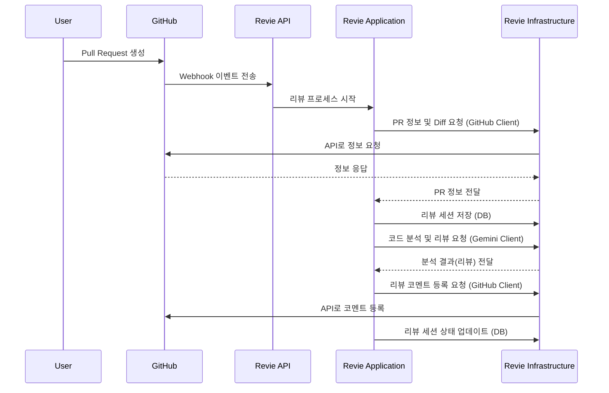

# Revie: AI 기반 코드 리뷰 자동화 시스템


Revie는 GitHub Pull Request 기반의 코드 리뷰 프로세스를 자동화하고 지능화하기 위해 설계된 AI 기반 시스템입니다. Google의 Gemini 모델을 활용하여 코드 변경 사항을 분석하고, 컨텍스트에 맞는 리뷰를 제공하여 개발 생산성 향상에 기여합니다.

## 📚 개요

개발자들은 코드 리뷰에 많은 시간을 소요하며, 때로는 반복적이거나 놓치기 쉬운 부분들이 발생합니다. Revie는 이러한 문제점을 해결하기 위해 AI를 도입했습니다. Pull Request가 생성되면, Revie는 자동으로 해당 PR의 코드 변경점(Diff)을 분석하고, 잠재적인 이슈, 개선 사항, 코드 스타일 위반 등을 식별하여 리뷰 코멘트를 생성합니다. 또한, 채팅 기능을 통해 리뷰 내용에 대해 AI와 대화하며 더 깊이 있는 분석을 수행할 수 있습니다.

## 📝 워크플로우



## ✨ 주요 기능

- **GitHub PR 연동**: GitHub의 Pull Request 이벤트를 기반으로 리뷰 세션을 자동으로 생성하고 관리합니다.
- **AI 코드 분석**: Google Gemini 모델을 사용하여 PR의 코드 변경 사항을 심층적으로 분석합니다.
- **벡터 기반 코드 검색**: 코드 변경점과 관련된 컨텍스트를 효과적으로 찾기 위해 코드 임베딩 및 벡터 검색 기술을 활용합니다.
- **자동 리뷰 코멘트 생성**: 분석된 내용을 바탕으로 PR에 직접 리뷰 코멘트를 제안합니다.
- **대화형 리뷰 (Chat)**: 생성된 리뷰나 특정 코드 라인에 대해 AI와 채팅하며 추가적인 질문과 분석을 진행할 수 있습니다.

## 🏗️ 아키텍처

본 프로젝트는 유지보수성과 확장성을 높이기 위해 **헥사고날 아키텍처 (Hexagonal Architecture)**를 채택한 멀티 모듈 프로젝트로 구성되어 있습니다.

- **`api`**: 외부 요청을 처리하는 API 계층입니다. (Spring WebFlux Controller)
- **`application`**: 핵심 비즈니스 로직을 포함하는 애플리케이션 계층입니다. (Service)
- **`domain`**: 프로젝트의 핵심 도메인 모델과 리포지토리 인터페이스를 정의합니다. (DTO, Entity, Repository Interfaces)
- **`infrastructure`**: 데이터베이스, 외부 API 클라이언트 등 외부 시스템과의 연동을 구현합니다. (R2DBC, MongoDB, Gemini/GitHub Client Implementations)

이러한 구조를 통해 각 계층은 독립적으로 개발 및 테스트가 가능하며, 특정 기술에 대한 의존성을 낮출 수 있습니다.

## 🛠️ 기술 스택

- **Language**: Kotlin
- **Framework**: Spring Boot, Spring WebFlux (Reactive)
- **AI**: Google Gemini
- **Database**:
  - R2DBC를 이용한 관계형 데이터베이스
  - MongoDB (대화 내역 저장)
- **Build Tool**: Gradle
- **Containerization**: Docker

## 🚀 시작하기

1.  프로젝트를 클론합니다.
    ```bash
    git clone https://your-repository-url/revie.git
    cd revie
    ```

2.  `docker-compose.yml` 파일에 필요한 데이터베이스 및 기타 서비스를 설정합니다.

3.  프로젝트 실행에 필요한 `application.yml` 파일의 설정값(GitHub Token, Gemini API Key 등)을 입력합니다.

4.  아래 명령어를 통해 프로젝트를 빌드하고 실행합니다.
    ```bash
    ./gradlew bootRun
    ```
    (Docker를 사용하는 경우)
    ```bash
    docker-compose up -d
    ```

---